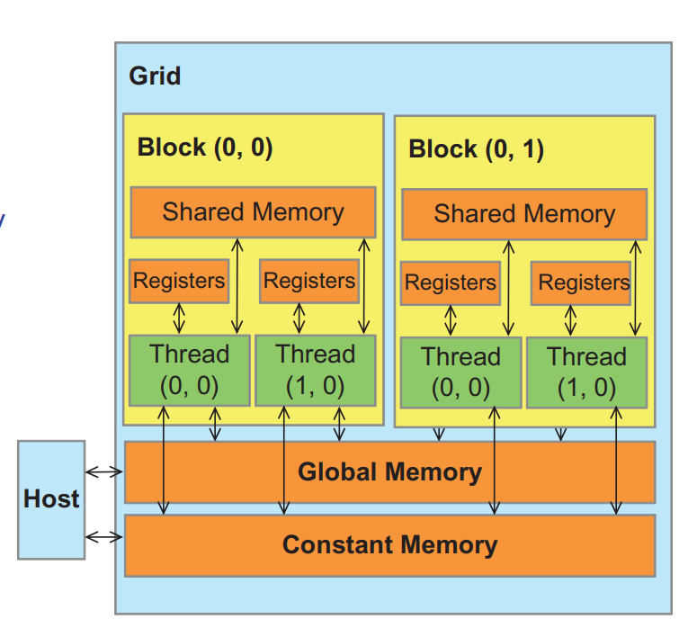
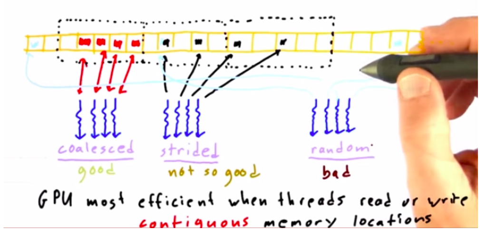
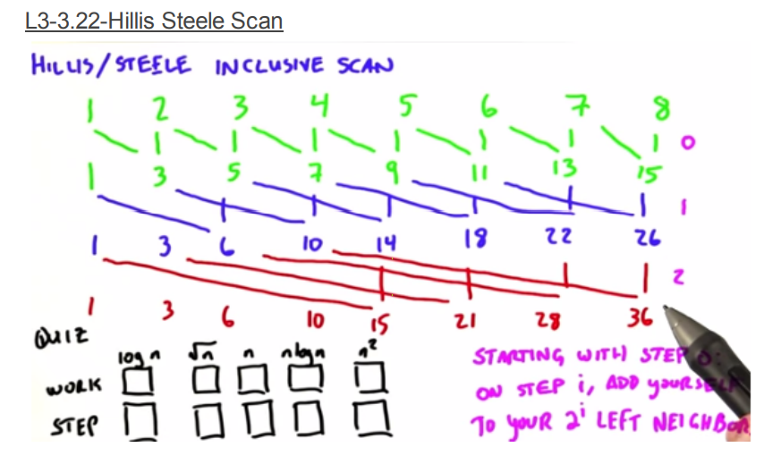
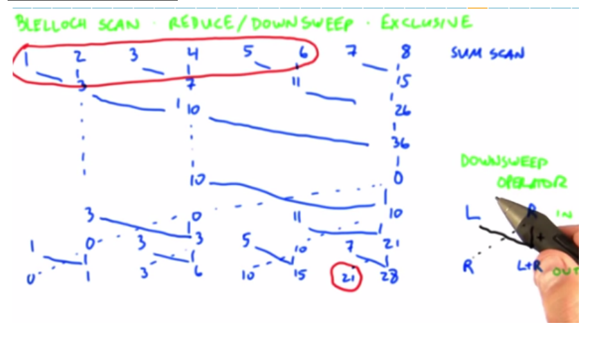
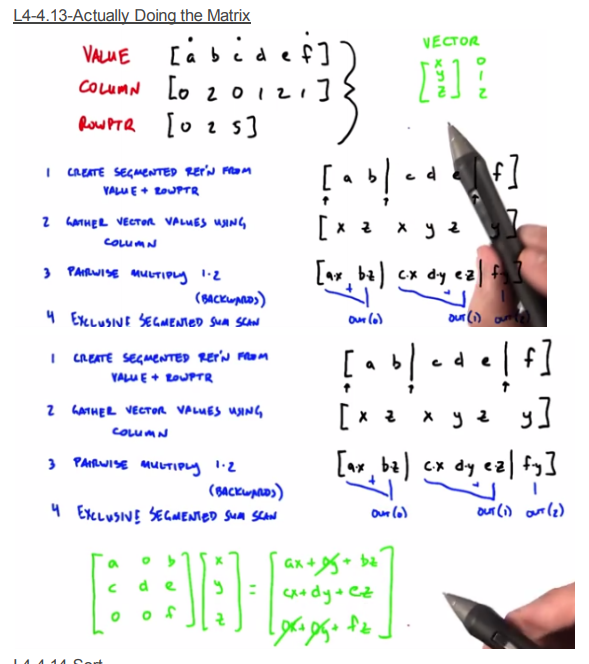

# Udacity Intro to Parallel Computing

course page: https://classroom.udacity.com/courses/cs344

course wiki: 

my problem set solution: 


## Lecture 2 GPU Hardware & Parallel Communication Patterns

### 基本通信方式

**map**: one to one 从task 到内存

**gather**: 聚合，例如卷积、blur

**scatter**: 得到结果，发散给其他内存单元，例如sort

**stencil**: 任务独立，但内存有重叠（only read)。注意，这种和gather区别在于stencil有模板定义，没有前者灵活。

**transpose**: 内存矩阵的转置,例如将许多struct中的float成员变量集中在一起。

后面还会接触到reduce，scan/sort等范式。


### GPU硬件

GPU负责把Blocks分配给SM,同时GPU无法保证blocks之间同时运行或依次运行。

CUDA提供了一种不依赖于SM数量的实现。但block之间的通信是缺失的。CUDA提供以下保证：

- a block在一个SM上运行；

- 一个kernel到下一个kernel时，该kernel的所有block必须完成计算。

  

memory model:




CUDA中的同步机制：

- Barrier: `_syncthreads();`

例如下述代码，array初始化并左移的操作

```c++
int idx = threadIdx.x;
__shared__ int array[128];
array[idx] = threadIdx.x;
if(idx < 127) {
    array[idx] = array[idx+1];
}
```

需要三个同步操作（每一次read/write操作都需要sync)，修改后的代码如下：

```c++
int idx = threadIdx.x;
__shared__ int array[128];
array[idx] = threadIdx.x;
__syncthreads();
if(idx < 127) {
    int temp = array[idx+1]; // 任何读写都应该拆开。
    __syncthreads();
    array[idx] = temp;
    __syncthreads();
}
```


GPU性能优化大的方向是：

- Math / Memory, 每个线程计算要多，访问内存的时间要少。

移动频繁访问的内存到更快的层级上：local > shared >> global >> host(cpu)

- coalesce global memory accesses

  相邻thread访问相邻的内存地址

  


GPU原子操作：例如1e6线程往长度为10的array写入数据。

```c++
int i = blockIdx.x*blockDim.x + threadIdx.x;
i = i%10;
atomicAdd(&g[i], 1); // add one
```

限制：仅有部分运算符，例如不支持!,pow，%d等，more to see atomic CAS()； no ordering constraints; serializes access(SLOW!)


thread divergence:

例如线程在if/else下面被分割成两个batch，然后执行顺序被发散。loop也会导致线程发散，例如`for(int i=0; i<=threadIdx.x;++i)`。


## Lecture 3: GPU Algo(Reduce, Scan, Histogram)

### Reduce

eg: 1+2+3+4

reduction operator: 必须是二元运算符，而且需要满足交换律

串行实现reduce操作一般for循环完事，复杂度$O(n)$.所谓的parallel reduce就是 ((a+b) + c) +d 转变为 (a+b) + (c+d)。

more to see: [Brent's Theorem](https://zhuanlan.zhihu.com/p/63351764)

reduce 求和：

```c++
__global__ void shmem_reduce_kernel(float *d_out, const float *d_in)
{
    extern __shared__ float sdata[]; // 大小在kernel调用的时候确定。
    int threadId = threadIdx.x + blockDim.x * blockIdx.x;
    int tid = threadIdx.x;
    
    sdata[tid]  = d_in[threadId];
    __syncthreads();
    
    for(unsigned int s = blockDim.x / 2; s > 0; s >>= 1)
    {
        if(tid < s)
        {
            sdata[tid] += sdata[tid + s]; // 等价于array[i] += array[i+ARRAY_SIZE/2];
        }
        __syncthreads();
    }
    // only thread 0 writes result for this block back to global mem
    if (tid == 0)
    {
        d_out[blockIdx.x] = sdata[0];
    }
}
```

当然，shared版本的kernel并未充分利用内存，还可以进一步优化。


### Scan

PS: 该节出现了step / work的概念，其实就是需要多少个单元进行处理（step）以及总的算法复杂度。

例如1,2,3,4,5,6，类似于`std::partial_sum`,结果为`1,3,6,10,15,21`。在数据压缩，稀疏矩阵计算中有所使用。

scan类问题和reduce一样，范式如下：

- input array
- binary associate operator
- identity element, 形式为[I op a = a]，scan问题还要求运算符支持具备单元元素，例如乘法的I为1，加法为0, or为false, and 为true.

scan问题可表达为：

[a0, a1,a2, .., an] -> [I, a0, a0 op a1, a0 op a1 op a2, ...  ]

上述问题可能导致最后一个数没有被操作，例如[3,3,1,5,9]取最大值(最小值IE为0)，output为[0,3,3,3,5],不包括9。这种scan方式叫exclusive scan，不包括当前值。而inclusive scan的结果为[3,3,3,5,9]，包括当前值。

Hillis & Steels Scan: 



可以看出，该scan算法复杂度为$nlog(n)$,即上图中长方形的面积。而总共需要$log(n)$次迭代。


Blelloch Scan



15-418 Lab2中的scan使用的是该方法，由up_sweep和down_sweep两部分组成。该方法使用的更多的steps,但其步骤像一个相对的两个三角形(⏳)，而不是长方形。对于大量长度的scan问题，blelloch方法总时间更小。


### Histogram

例如对时间序列的数据进行分类，形成类似于树状图的结果。

串行的histogram代码如下：

```c++
for(const auto& d : data_set){
    result[classify(d)]++; // classify为数据分类函数
}
```

显然，result作为global数据，是并行化处理的关键。PS: 将block内的数据shared，然后再求和？课程提出了三种方法：

1. 原子操作

   ```c++
   atomicAdd(&result[classified_res],1);
   ```

   该方法的并行speedup不会太好，尤其是result的bucket较小时。

2. 每个thread拥有自己的result (local memory), 然后对每个thread的result进行reduce操作。

3. 将data变成hash(key为data, value为1，reduce flag)。然后排序（后面会讨论）。


### PS3 tone mapping

整个的flow是reduce->histogram->prefix_sum。注意以下事项：

- 本地原则，不要在当前threadId写这类语句`sh_data[threadId+offset] += sh_data[threadId]`;

- 赋值注意同步，例如将上述语句还有另一个问题，不能不同步的时候就取用，应该改成

```c++
   for (unsigned int offset = 1; offset <= numBins / 2; offset <<= 1)
   {
      int left = threadId - offset;
      int left_val = 0;
      if (left >= 0)
         left_val = s_cdf[left]; // 读lock
      __syncthreads();
      if(left >= 0)
         s_cdf[threadId] += left_val; // 写lock
      __syncthreads();
   }
```


## Lecture 4: GPU Algo(Sort, Scan)


filter：

predicate -> scan -> scatter（聚合），类似与map-reduce,将数据过滤后压缩成更短的集合。


分段exclusive scan:

就是将数组分段，然后各自prefix sum.

### Spmv

SpMv: 稀疏矩阵乘法，例如PageRank，web R（横轴） -> web C（纵轴）。

Compressed Sparse Row: CSR表示法

例如：

```
a 0 b    x
c d e  * y
0 0 f    z
```

非零值 value: [a,b,c,d,e,f]

这些非零值来自哪个column: [0,2,0,1,2,1]

同样的ROWPTR: [0,2,5],注意，这里的row为啥3个就够了？我们知道，matrix是n*n的，然后只需要知道每一行第一个非零值在value中的index即可。



很清晰，怎么用CUDA写呢？😄

ref: https://zhuanlan.zhihu.com/p/383115932


### Sort

brick sort: 两两成对，然后排序.算法复杂度O(n^3)

eg: [5,1], [4, 2] 3  ->  [1, 5],[2,4],3 -> 1,[2,5],[3,4]->[1,2],[3,5],4->1,2,3,4,5


merge sort:

分为几个阶段，一个线程能hold住的阶段，一个block能hold住的阶段（task per block), final merge

这里有个问题，如何parallel merge? 例如两个有序array合并。

每一个array已经知道它自己的index，然后去其他array二分查找其lower_bound即可。

然而，merge sort最难的是final merge，大量的数据，batch数量很少。如何将其分解给其他SM呢？

例如[1~432432], [3~435436]我们可以将这个数组继续分解成小的块，然后进行合并。两个列表的sub chunk的起点和终点是一致的。


**sorting networks**

核心思路：保证并行swap

冒泡

但需要多次比较，因此无论数据排序质量如何，时间复杂度一样。not good


**radix sort**

基数排序，二进制由低位到高位依次排序。0/1分类就是上面提到的compact操作。

GPU上很快。


**quick sort**

复习下，写个串行的quick sort:

```c++
// todo
```

GPU不支持递归，但支持kernel 去launch其他kernel


### PS4 radix sort of CUDA

先看下CPU版本的radix sort（reference_calculation),很容易理解。

GPU版本的流程如下：


more to see: https://developer.nvidia.com/gpugems/gpugems3/part-vi-gpu-computing/chapter-39-parallel-prefix-sum-scan-cuda

图中`totalFalses`就是0/1的histogram[0]。

按照上图中的flow写下来，基本没啥问题，难度不大。（但如果没有上图作为参考，地狱难度😂）


## Lecture 5: Optimizing GPU Programs 

GPU有效计算的几个原则：

- 最大化算术密度（arithmetic intensity)
- 减少内存相关的操作，包括全局内存的读取次数
- 避免thread divergence

### GPU优化

1. better algorithms；
2. 满足上述有效计算的原则；
3. arch-specific detailed optimizations, 例如vector register-SSE, AVX, L1 cache优化等；
4. 指令集优化。

对于GPU而言，1~2能获得3~10X的加速比，是优化的重点。而3带来的好处一般在30%~80%之间。CPU则不同，第三类优化可以带来较大的性能提升。


#### APOD:优化流程

analyze -> parallelize -> optimize -> deploy, 循环。

parallelize方式一般有：用libraries，directives(openMP, OpenACC), 更换编程语言（CUDA, ISPC)

Optimize: profile-driven optimization, 多测多分析


weak scaling / strong scaling: 
1.strong scaling: 使问题规模保持不变，增加处理器数量，用于找到解该问题最合适的处理器数量。即所用时间尽可能短而又不产生太大的开销。绘制如下图形：


2.weak scaling: 让问题规模（计算量）随处理器数量增加而增加。理想情况：


strong scaling的结果较难达到，因为随着处理器数量的增加通信开销成比例上升；而weak scaling的结果较容易达到。

ref：https://blog.csdn.net/Cobb141/article/details/106994450

https://www.kth.se/blogs/pdc/2018/11/scalability-strong-and-weak-scaling/


#### Analyze: profiling

分析分为两部分：找hotspots,常用的profiler有：gprop, vTune, VerySleepy.  

"Amdahl's Law" 加速比和可并行化的比例有关。


### Parallelize: 一个矩阵转置的例子

查询设备信息：

`/usr/local/cuda-10.2/samples/1_Utilities/deviceQuery`

编译后运行


例如我的MX150,

Memory clock: 3004 Mhz = 3004*10^6 clocks/sec

Memory Bus Width: 64-bit = 8bytes

其理论的带宽峰值为：37.55 GB/s, 

带宽峰值：75% excellent 60~75% good 40~60% okay, 


例如长度为1024的矩阵转置，其带宽峰值为：

1024*1024 * 4(四个字节) * 2(读写两次) / 0.67ms = 1.25*10^10, 12.5GB/s。


cuda的内存对齐：coalescing(418提到过这个概念，类似于内存对齐)


可以使用nsignt Eclipse（Linux, Mac)检测峰值带宽。至于课中提到的NVVP，和Visual Profiler 后面将会弃用，其功能被集成到Nsight中。


**问题**：CUDA中进行矩阵转置的机制可以描述下吗？

ref:

https://developer.nvidia.com/blog/efficient-matrix-transpose-cuda-cc/

- Shared Memory Bank Conflicts
- padded shared memory(google it~)


#### Shared Memory

~~作者给了一个使用shared memory局部转置的例子，比较简单。显然，这个case也是错误的。因为cuda无法保证blocks之间的执行顺序。~~


对于使用线程同步的代码而言，减少threads per blocks的数量能减少每个线程的平均等待时间。同时增加每个SM中的blocks数量也可以达到该效果（why?)


每个SM上的blocks数量和共享内存大小都是有限的。

例如我手头上这个垃圾MT150:

- Maximum number of threads per multiprocessor：2048
- threads per block: 1024
- registers for all threads: 65536
- shared memory per block: 49152 bytes

显然，每个SM上的线程数量是最为紧俏的计算资源


**计算资源的最大化利用有两个关键方向：**

- **减少同步造成的等待时间 minimize time waiting at barriers**
- **避免线程分化 thread divergence**


#### Thread Divergence

warp: set of threads that execute the same instruction at a time;

SIMD: CPU(SSE/AVX vector registers)

SIMT: GPU


thread divergence带来的后果：

- 每个warp有32个线程，最多带来32倍的减速比

- thread divergence问题往往需要一个新的算法来解决。

- 代码中尽量避免boundary check


tips:

- 如果非必须，避免用double

```c++
float a= b + 2.5;  // slower
float a = b + 2.5f // quicker
```

- 尽量使用cuda内置的函数

```
__sin()
__cos()
__exp()
```

- 如果不急着用，可以使用`cudaMemcpyAsync()`，减少阻塞


#### Steams

使用cudaMemcpyAsync()可以实现类似并发的效果，边计算边拷贝数据。


### PS5 histogram优化

ref: 

https://github.com/NVIDIA/thrust/blob/main/examples/histogram.cu

Programming  Massively Parallel  Processors (book PMPP) Chapter 9


比较下PMPP Chapter9中的实现，对比其计算时间。

| 代码                    | 计算时长 |
| ----------------------- | -------- |
| CPU                     | 25.22ms  |
| atomic add              | 3.536ms  |
| book PMPP: strategy I   | 3.38ms   |
| book PMPP: strategy II  | 3.521ms  |
| book PMPP: strategy III | 2.313ms  |
| book PMPP: strategy IV  | 2.45ms   |

基于排序的方法可以发现，排序消耗的时间大概为26ms左右，显然在1024*10000这个数组量级下，基于排序的方法无法满足要求。

- book PMPP: strategy I & II, 本质上和atomic add 等价的，只是给出了线程数量有限（例如远小于array长度）的解法。
- book PMPP: strategy III:  shared memory。要仔细考虑下TPB远小于numBins的情况。因此解决方案是每个thread都要处理

注意下：

```c++
for (unsigned int i = tid; i < num_elements; i += blockDim.x*gridDim.x)
```

等价于if语句溢出的thread提前退出，但可以缓解threads divergence。

而下述的：

```c++
  for(unsigned int binIdx = threadIdx.x; binIdx < numBins; binIdx += blockDim.x){
    s_histo[binIdx] = 0u;
  }
```

等价于于多个线程并行地去初始化共享内存，嗯，比较巧妙~。

- book PMPP: strategy IV: 书中的代码有些错误，改过来了。没什么特别的，就是针对如果数组某个区间有大量相同的值（例如图片的白云），通过cache操作可以提高吞吐量（减少atomic操作的次数）。


## Lecture 6: Parallel Pattern

### All Pairs N-Body

多体之间的相互作用力。可以在GPU Gems3找到相关的讨论。

- O(nlog(n)) : tree methods (barnes-hut)

- O(n) fast multipole method 快速多级算法, 20世纪10大算法之一

问题先转换为N*N矩阵。如果想得到`mat[i][j]`，则需要遍历其他n-1的元素(列或行)。可以假设列为来源值，行为目标输出值。


先将其分解更小的tile: P X P.根据上面假设，我们需要P个Thread来计算这个矩阵。

当然shared memory有限，P不能太大。课程讲这个case看重的是分解颗粒度的trade-off。

emm，分解之后，如何merge呢？

按照下图的flow应该不存在merge的问题，就是个简单的多线程处理模型：


ref: 

https://developer.nvidia.com/gpugems/gpugems3/part-v-physics-simulation/chapter-31-fast-n-body-simulation-cuda


### SpMV

稀疏矩阵相乘。

这里有个取舍，矩阵与向量乘法为例，一个线程应该处理多少的矩阵数据，可以为一个数据，也可以为一行数据。两个都是对的，视情况而定。

前者线程数量更多，线程间数据交换更多，而后者单个线程计算量更大。


线程更多的计算量带来的问题是，计算量不均衡的情况下，其他线程为了等待最大计算量线程而消耗大量的等待时间。

对于矩阵与向量乘法为例，如果是一个线程处理单个矩阵数据，需要增加scan操作来对结果进行汇总。但每个线程的计算量是均衡的，性能表现主要取决于矩阵数据的大小。


当然还有混合的方法，需要对稀疏矩阵的集中度分布有着很好的判断。


### BFS

bfs里面的深度(level)的概念不再赘述。

节点数量为N, 图的最大深度为N-1, 最小深度为1。其实这个值和问题的并行度相关，链表的BFS search的并行加速很差。


CUDA 版的BFS

- part1: 初始化visited节点矩阵，起点深度设为0，未访问的节点深度为-1；
- part2: 每个线程处理一条边，迭代一次代表一次深度递增，依据source node的深度，把destination node的节点深度值都更新下；
- part3: 迭代part2，找到终点

一些问题：

- host如何结束循环？传入一个指针flag(每迭代依次从device传回host), 或设置max iteration 限制
- 两个深度为2的节点都指向同一个深度为3的点，会不会有data race? no~


### PS6 图片拼接

分两部分讨论：算法和CUDA实现

**算法：**该问题就是将一张较小的图片融入到源图片中。首先，如何找到要融合的位置？emm，不属于这个作业的内容，提供的两个图片是对齐的。那剩下就是确定三个区域，核心区域（这个destImag的权重更大），边界区域（这个不好说，平均吧），背景图像区域（这个完全是source图片的值），然后迭代平均下梯度即可。

**CUDA实现**：参考refernce_calc.cpp中的实现，写个没经过优化的CUDA版本不难。


优化思路：

泊松迭代类似于在mask内进行卷积操作，CUDA卷积操作的优化可以参考PMPP chapter ?


### More about BFS

简要介绍了下基于CSR压缩数据结构下的bfs。没什么特别的。


### List Ranking

列表排序：

ref: https://cs.msutexas.edu/~ranette/Dissertation/Chapter%202.pdf

比较古老而且用处不太大，可视为lecturer的私货。


### Hash Table

Cuckoo Hash: 贪心分配，然后替换碰撞的键值对，不断迭代寻找解。

但不一定有解，看概率。GPU适合这种无序的散列表，让所有的线程忙碌地去迭代找bucket，而像树、排序二分这类更适合在CPU上处理。


## Lecture 7: More Parallel Computing

### Parallel Optimization patterns

Paper: Stratton et al 2012, 7个基本并行优化的技术

**tech1: data layout transformation**

重新组织数据，例如下面两个struct:

```c
struct f{
  float a;
} A[8];

struct f{
  float a[8];
} A;
```

**tech 2 scatter to gather transformation**

区分代码在内存上是进行发散操作，还是收集操作，一般后者的更多的读操作，显然速度更快。


**tech3: tiling**

利用共享内存cache一下数据然后进行分发，避免全局性的直接拷贝或移动数据。


**tech4: privatization**

例如histogram，在reduce操作时(atomicAdd)可以限制local memory上进行规约操作。


**tech 5 Binning/ spatial data structures**

> binning: build data structure that maps output locations to a small subset of the relevant input data

例如二维轨迹带碰撞检测，先使用最大footprint边长创建一个网格，将轨迹点都映射到这个网格中，计算点与点之间碰撞时，可忽略非相邻网格的点。


**tech6 compaction**

例如CSR表示稀疏矩阵，或进行mask过滤一个数组。


**tech7 regularization**

正则主要是为了load balance,对于数据分布比较清晰的input较为有效。

> reorganizing input data to reduce load imbalance


### Libraries

**cuBLAS: ** 线性代数求解库

**cuFFT:** FFT

**cuSPARSE:** BLAS-like routines for sparse matrix formats

**cuRAND / NPP / Magma / CULA / ArrayFire**


**CUB**

针对硬件不同，移植CUDA代码时，CUB可以自动地解决线程启动数量、shared memory大小这类硬件相关地参数。

**CudaDMA**

> template library designed to :
>
> - make it easier to use shared memory
> - at high performance


### Programming power tools

PyCUDA, Copperhead(generates thrust code), CUDA Fortran

跨平台：

OpenCL, OpenGL Compute, OpenACC（基于指令集，相当于加强版本地OpenMP）。


### Dynamic Parallelism

bulk parallelism: 一对一,每个线程做同样地事情。

Nested parallelism: 嵌套地并行，

task / recursive parallelism 


dynamic parallelism 

每个线程都可启动kernel。对于像递归这种就很有用，可以在kernel中启动更小的kernel.


## Review

重要性：⭐⭐

难度：⭐⭐

课程质量：⭐⭐⭐⭐

先谈缺点：

- 该课程涵盖的只是Parallel Computing中一小部分内容，对于学习CUDA有着很好的启发，但还有很多并行计算以及GPU编程内容需要进一步深入。同时，该课程对机器学习CUDA加速相关的内容也是缺失的，需要自己额外补充；
- 作业难度一般，没有autograder;
- 手写PPT，内容不是很丰富。课程要讲的是一个很大的题目：parallel computing，但讲的内容是这一领域的一小部分。

优点是简单，对CUDA的一些范式基本都涵盖到了，作为CUDA的入门课非常合适。


